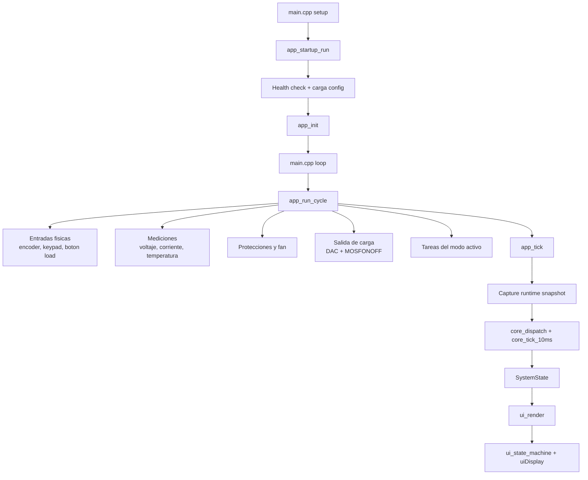

# Arquitectura del Codigo

Este documento resume la arquitectura general del firmware de la carga electronica DC Load ESP32.
El objetivo es explicar como esta organizado el codigo, que responsabilidad tiene cada seccion y como fluye la informacion durante la ejecucion normal.

No busca detallar funcion por funcion. La idea es dejar un mapa de alto nivel para orientarse rapido en el proyecto.

## Vista General

El firmware esta dividido en capas con responsabilidades bastante claras:

- `config/`: constantes globales de hardware y limites base del sistema.
- `hw/`: objetos fisicos compartidos, como DAC, ADC, RTC, TFT y encoder.
- `hal/`: acceso directo y fino al hardware de entrada/salida.
- `app/`: logica de runtime, contextos vivos, adquisicion de datos, protecciones y salidas fisicas.
- `core/`: maquina de estados principal y reglas de navegacion, modos, menus y acciones del usuario.
- `ui/` y `ui_display.*`: transformacion del estado a pantallas y render de la interfaz TFT.
- `storage_eeprom.*`: persistencia en EEPROM.

En terminos simples:

- `app` mira el mundo fisico.
- `core` decide el comportamiento.
- `ui` muestra ese comportamiento.

## Flujo de Arranque

El punto de entrada es [main.cpp](/c:/Users/thetr/Documentos/PlatformIO/Projects/DC_Load_ESP32/src/main.cpp).

1. `setup()` llama `app_startup_run()`.
2. Startup configura pines, perifericos y hace el health check.
3. Startup arranca con `MOSFONOFF` en estado de emergencia seguro.
4. Si el health check falla, el arranque queda detenido mostrando la falla y no continua.
5. Si todo esta bien, libera `MOSFONOFF`, carga configuracion persistida y limpia la UI inicial.
6. Luego `app_init()` inicializa el `core` y la cola de acciones.
7. A partir de ahi `loop()` entra en el ciclo principal con `app_run_cycle()`.

## Flujo del Ciclo Principal

La rutina central vive en [app_runtime.cpp](/c:/Users/thetr/Documentos/PlatformIO/Projects/DC_Load_ESP32/src/app/app_runtime.cpp).

En cada iteracion del `loop`, el firmware hace esto:

1. Actualiza el control de ventilador.
2. Lee encoder, teclado y boton de carga.
3. Toma mediciones analogicas.
4. Evalua protecciones.
5. Aplica la salida de carga hacia DAC y `MOSFONOFF`.
6. Ejecuta tareas de modo cuando esta en Home.
7. Sincroniza estado runtime con `core`.
8. Procesa acciones del usuario.
9. Actualiza la UI.

## Diagrama de Flujo

## Que Hace Cada Capa

### `config/`

Contiene configuracion base del sistema, especialmente en [system_constants.h](/c:/Users/thetr/Documentos/PlatformIO/Projects/DC_Load_ESP32/src/config/system_constants.h).

Define:

- pines de hardware
- limites globales
- factores de conversion
- constantes de modos y runtime

Es la referencia principal cuando queres saber que GPIO corresponde a cada funcion fisica.

### `hw/`

En [hw_objects.h](/c:/Users/thetr/Documentos/PlatformIO/Projects/DC_Load_ESP32/src/hw/hw_objects.h) y [hw_objects.cpp](/c:/Users/thetr/Documentos/PlatformIO/Projects/DC_Load_ESP32/src/hw/hw_objects.cpp) se centralizan los objetos globales de hardware:

- `dac`
- `ads`
- `rtc`
- `tft`
- `encoder`

Esta capa no decide comportamiento; solo concentra los recursos fisicos compartidos.

### `hal/`

La carpeta `hal/` encapsula accesos simples al hardware.

Ejemplos:

- leer boton de carga
- leer boton del encoder
- leer el keypad
- activar buzzer
- hacer delays o leer contador del encoder

Sirve como capa fina entre el hardware crudo y la logica de aplicacion.

### `app/`

Es la capa operativa del sistema.
Se ocupa de todo lo que pasa en tiempo real fuera de la maquina de estados principal.

Aca viven:

- contextos de runtime como setpoint, modo, bateria, fan, temporizador y trazas
- toma de mediciones
- control de salida de carga
- protecciones
- flujo de startup
- OTA
- logica especifica de modos en Home
- sincronizacion entre runtime y `core`

Algunos bloques importantes:

- [app_startup.cpp](/c:/Users/thetr/Documentos/PlatformIO/Projects/DC_Load_ESP32/src/app/app_startup.cpp): arranque, init y health check
- [app_measurements_poll.cpp](/c:/Users/thetr/Documentos/PlatformIO/Projects/DC_Load_ESP32/src/app/app_measurements_poll.cpp): adquisicion de mediciones
- [app_protection.cpp](/c:/Users/thetr/Documentos/PlatformIO/Projects/DC_Load_ESP32/src/app/app_protection.cpp): protecciones y corte de emergencia
- [app_load_output.cpp](/c:/Users/thetr/Documentos/PlatformIO/Projects/DC_Load_ESP32/src/app/app_load_output.cpp): control de DAC en operacion normal y uso de `MOSFONOFF` solo para emergencia
- [app_runtime_home.cpp](/c:/Users/thetr/Documentos/PlatformIO/Projects/DC_Load_ESP32/src/app/app_runtime_home.cpp): tareas activas de modos como `BC`, `TC` y `TL`
- [app_runtime_sync.cpp](/c:/Users/thetr/Documentos/PlatformIO/Projects/DC_Load_ESP32/src/app/app_runtime_sync.cpp): puente entre estado runtime y estado del `core`

### `core/`

`core/` es la maquina de estados de mas alto nivel.
No lee directamente sensores ni dibuja la pantalla; decide que significa cada accion del usuario y como debe evolucionar el sistema.

Sus responsabilidades principales son:

- mantener el `SystemState`
- procesar acciones de usuario
- manejar modos `CC`, `CP`, `CR`, `BC`, `TC`, `TL`, `CA`
- navegar menus y pantallas
- controlar setups y ediciones
- producir eventos de guardado o transicion

Piezas clave:

- [core_engine.cpp](/c:/Users/thetr/Documentos/PlatformIO/Projects/DC_Load_ESP32/src/core/core_engine.cpp): loop logico del `core`
- [core_state.h](/c:/Users/thetr/Documentos/PlatformIO/Projects/DC_Load_ESP32/src/core/core_state.h): estructura `SystemState`
- [core_modes.cpp](/c:/Users/thetr/Documentos/PlatformIO/Projects/DC_Load_ESP32/src/core/core_modes.cpp): comportamiento comun por modo
- [core_config_menus.cpp](/c:/Users/thetr/Documentos/PlatformIO/Projects/DC_Load_ESP32/src/core/core_config_menus.cpp): menu de configuracion
- [core_setup_flows.cpp](/c:/Users/thetr/Documentos/PlatformIO/Projects/DC_Load_ESP32/src/core/core_setup_flows.cpp): pantallas de setup para bateria y transitorios

### `ui/` y `ui_display.*`

La UI esta separada en dos niveles:

- `ui_renderer.cpp`: convierte `SystemState` en `UiViewState`
- `ui_state_machine.cpp`: decide que pantalla renderizar y cuando redibujar
- `ui_display.cpp`: contiene el dibujo real sobre la TFT

Eso permite que el `core` maneje el estado sin quedar acoplado a primitivas de dibujo.

Flujo de render:

1. `core` produce `SystemState`
2. `ui_renderer` arma una vista amigable para UI
3. `ui_state_machine` decide la pantalla y controla invalidaciones
4. `ui_display.cpp` dibuja la pantalla concreta

En menus y pantallas de configuracion, los cambios del RTC ya no fuerzan un redraw completo del contenido: solo se actualiza el footer con fecha y hora.

### Persistencia

La EEPROM se maneja con:

- [storage_eeprom.cpp](/c:/Users/thetr/Documentos/PlatformIO/Projects/DC_Load_ESP32/src/storage_eeprom.cpp)
- [app_limits_storage.cpp](/c:/Users/thetr/Documentos/PlatformIO/Projects/DC_Load_ESP32/src/app/app_limits_storage.cpp)

Se usa para guardar valores durables como:

- limites
- configuracion de fan
- datos de calibracion

## Como Fluye la Informacion

Hay dos flujos principales que conviven:

### Flujo fisico

Va desde el hardware hacia el runtime y de vuelta al hardware.

- entradas fisicas -> `hal/` -> `app/`
- sensores -> `app_measurements_*`
- salida de control -> `app_load_output`
- alarmas y fan -> `app_protection` y `app_update_fan_control`

### Flujo logico

Va desde el runtime al `core`, luego a la UI.

- `app_runtime_sync_capture()` toma una foto del runtime
- `core_sync_from_runtime()` actualiza el contexto logico
- `core_dispatch()` procesa acciones del usuario
- `core_tick_10ms()` hoy actua como hook temporal del `core`, pero todavia no contiene logica de negocio relevante
- `app_runtime_sync_apply()` devuelve al runtime lo que el `core` decidio
- `ui_render()` lleva ese estado a pantalla

## Rol de `SystemState`

`SystemState` es el centro del modelo logico del firmware.
No representa solo la pantalla actual: representa el estado total del sistema visto por el `core`.

Incluye:

- medidas y setpoints
- modo activo
- estado de carga
- posicion y configuracion del encoder
- borradores de menus
- datos de setup
- eventos de guardado
- pantalla actual

Es, en la practica, el contrato principal entre logica, runtime y UI.

## Filosofia de Separacion

El proyecto sigue una idea bastante sana:

- la lectura del mundo real vive en `app/`
- las decisiones de navegacion y estado viven en `core/`
- la representacion visual vive en `ui/`

Eso hace mas facil:

- cambiar la UI sin romper la logica
- agregar modos nuevos
- ubicar bugs por capa
- revisar el flujo completo sin mezclar dibujo, hardware y reglas de negocio

## Puntos de Entrada Recomendados para Leer el Proyecto

Si alguien entra nuevo al repo, conviene recorrerlo en este orden:

1. [main.cpp](/c:/Users/thetr/Documentos/PlatformIO/Projects/DC_Load_ESP32/src/main.cpp)
2. [app_startup.cpp](/c:/Users/thetr/Documentos/PlatformIO/Projects/DC_Load_ESP32/src/app/app_startup.cpp)
3. [app_runtime.cpp](/c:/Users/thetr/Documentos/PlatformIO/Projects/DC_Load_ESP32/src/app/app_runtime.cpp)
4. [app_loop.cpp](/c:/Users/thetr/Documentos/PlatformIO/Projects/DC_Load_ESP32/src/app/app_loop.cpp)
5. [app_runtime_sync.cpp](/c:/Users/thetr/Documentos/PlatformIO/Projects/DC_Load_ESP32/src/app/app_runtime_sync.cpp)
6. [core_engine.cpp](/c:/Users/thetr/Documentos/PlatformIO/Projects/DC_Load_ESP32/src/core/core_engine.cpp)
7. [ui_renderer.cpp](/c:/Users/thetr/Documentos/PlatformIO/Projects/DC_Load_ESP32/src/ui/ui_renderer.cpp)
8. [ui_state_machine.cpp](/c:/Users/thetr/Documentos/PlatformIO/Projects/DC_Load_ESP32/src/ui/ui_state_machine.cpp)
9. [ui_display.cpp](/c:/Users/thetr/Documentos/PlatformIO/Projects/DC_Load_ESP32/src/ui_display.cpp)

## Resumen Corto

Pensado en una frase:

`app` conecta con el hardware, `core` decide el comportamiento y `ui` muestra el resultado.

Pensado en una cadena:

entradas y sensores -> runtime `app` -> estado logico `core` -> render `ui` -> pantalla y salidas
